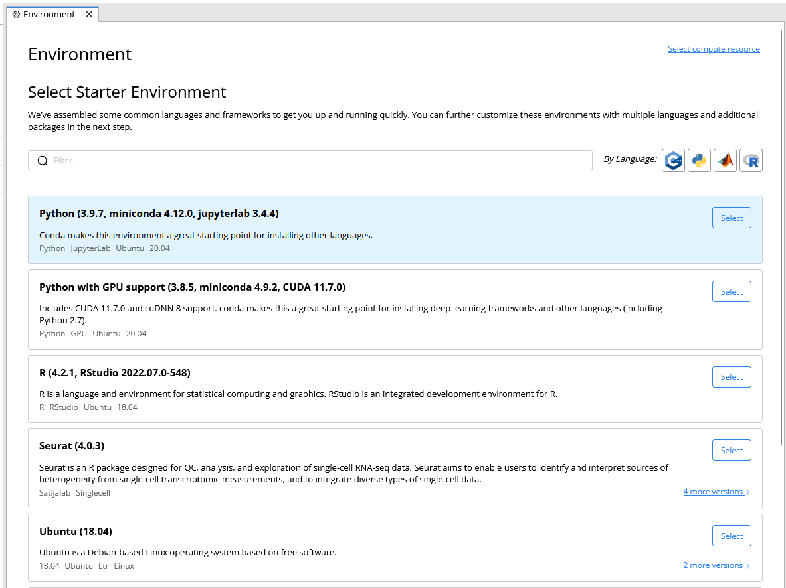

[](https://www.codeocean.com/product/)
# Coding Workshop


### Requirements for Participating in this Workshop

- *Code Ocean* v2.0 or newer
- *Code Ocean* API Access Token
    - There are instructions below on how to create one 
- Python >=3.8


---

### Creating an API Access Token

1. Click on the `Account` icon in the lower lefthand corner.
    - 
2. Click on `Access Tokens`
    - 
3. Click on `Generate new token`
    - 
4. Add a name for your new token and select all 4 checkboxes
    - 
5. Click on the `Add Token` button.
6. Click on `Copy` to copy the token to your clipboard
    - 
7. Paste the token into your favorite password manager so that it will be available later when we update a configuration file.

---

## Setting up this capsule in *Code Ocean*

1. Create a new capsule and select **copy from public git**
    - 
2. Enter the url for this github repo
    - `https://github.com/codeocean/coding_workshop.git`
3. Select a starter environment that has python available. The **Python (3.8.5, miniconda 4.9.2, jupyterlab 3.0.9)** starter environment that came preinstalled with *Code Ocean* will work.
    - 


4. Click on **Edit Post-Install Script**
    - 

5. Add the following code to the postinstall script

```
apt-get update
apt-get install build-essential ca-certificates default-jre libz-dev pigz vim wget -y

conda update conda -y && conda update --all -y
conda install -c conda-forge mamba -y
mamba install -c bioconda fastqc -y

# Code Ocean Aux Tools
pip install -i https://test.pypi.org/simple/ Code-Ocean-Aux-Tools
pip install multiqc

# fastp
mkdir -p /opt && cd /opt
wget http://opengene.org/fastp/fastp
chmod a+x ${PWD}/fastp
ln -s ${PWD}/fastp /usr/local/bin

# Simulated reads generator
mkdir -p /opt && cd /opt
git clone https://github.com/lh3/wgsim.git
cd wgsim
gcc -g -O2 -Wall -o wgsim wgsim.c -lz -lm
ln -s ${PWD}/wgsim /usr/local/bin

```

6. Add the API token in the `config.py` file (in the `code` folder) on the line that has `co_api_key = ""`
    - The token should be inside the double quotes.

7. Copy your current *Code Ocean* host name. This will be everything after `https://` and before `/capsule/` in the URL of your web browser where you access *Code Ocean*. 
    - e.g. `https://mybiotechcompany.com/capsule/`
    - You would copy `mybiotechcompany.com`

8. Paste the host name in the `config.py` file on the line that has `co_domain = ""`
    - The host name should be inside the double quotes.

9. Add your first name in the `config.py` file on the line that has `user = ""`
    - Your first name should be inside the double quotes.

10. You are now ready to participate in the **Coding Workshop**


---

[Code Ocean](https://codeocean.com/) is a cloud-based computational platform that aims to make it easy for researchers to share, discover, and run code. Visit our [Open Science Library](https://codeocean.com/explore) for free code, demo our free product, and publish your code associated with your publication. Contact our [sales](https://codeocean.com/contact-us/sales/) for a demo of our [enterprise VPC product](https://codeocean.com/product/).

[](https://www.codeocean.com)
